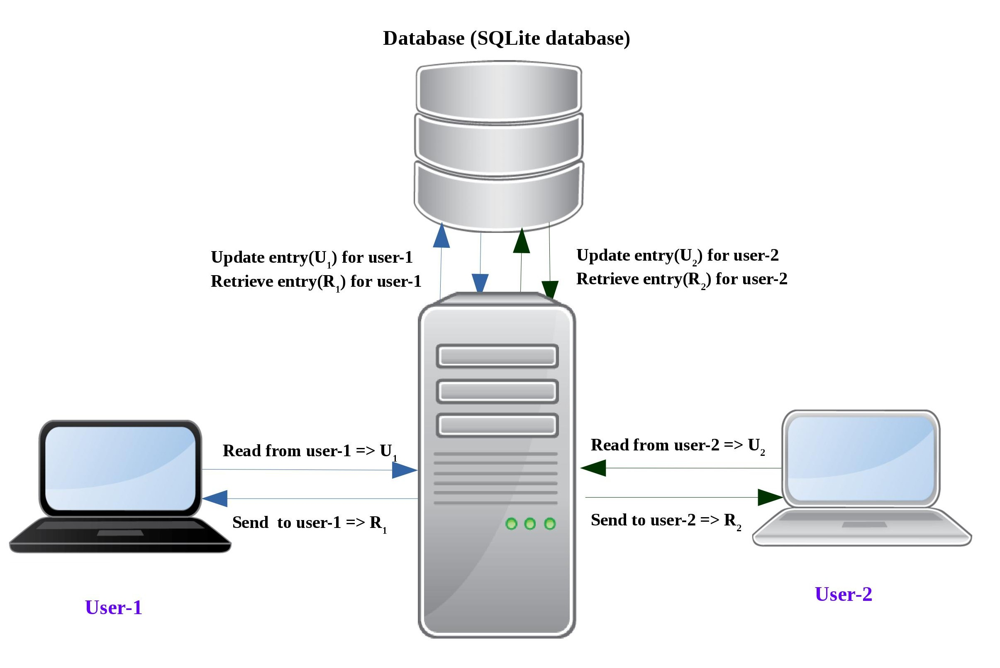

# Simple chat application using Mulithreaded Socket programming in C++
<h2>Objective : </h2>

	In this project there will be one server and multiple clients. Among those clients any two clients can chat with each other. Server will have a sqlite database into which all informations corresponfing those clients will be stored.

<h2>Model : </h2>

	The model will consist of one server and one database. Only server has the privilage to access the database and it only can manipulate the database. In this particular project there were two clients. In the server when a client will make a successfull connection then server will create a thread and that child thread will do all those necesary jobs for the clients in future till the partiular client will be connected with the server. That thread will create two threads to perform these following tasks:
			<ol>
				<li> Server will ask the client to type its username</li>
				<li> Server will check if the user has been already registered or not. If the user is not registered then it will create an entry for the client and assign an unique password to the client. If the user is already been registered then it will ask for password. After giving proper credentials the user can successfully logging in and start sending message.</li>
				<li> One thread will read from the client socket and update the database.
				</li>
				<li> Another thread will retrieve data for a client and peform some short of filtering to prevent sending duplicate messages and after doing this it will write the filrered data to the particular client socket.</li>
			</ol>
			

<h2> Setup the environment: </h2>

 For socket programming we need some libraries and most of the linux operating system will have those headers and their binary pre-installed in the system. For this particular project we need sqlite3 headers and the binary. If sqlite3 binary and the header is not installed then we need to install them. The procedure is described as below: 
<ul>
	<li> Download the tar file from the link Given : <a href="http://www.sqlite.org/2017/sqlite-autoconf-3170000.tar.gz">sqlite-amalgamation-3170000.zip</a></li>
	<li>
		After downloading, install the library with the sqlite3 binary :
		<ol>
			<li>cd ~/Downloads</li>
			<li> tar xvfz sqlite-autoconf-3170000.tar.gz</li>
			<li>cd sqlite-autoconf-3070000</li>
			<li>./configure --prefix=/usr/local</li>
			<li>sudo make</li>
			<li>sudo make install</li>
		</ol>
	</li>
</ul>
<h2> Working example : </h2>
	<ul>
		<li>After running the server on a specified port ( port > 1024) the server will wait for a client to connect with the server : -> <b>./server 8080</b></li>
		<li> if a client will run on the server ip address with the specified port then server 		will ask the client to type username : 
			<ol>
				<li> <b>./client1 X.Y.Z.W PORT_NO</b> </li>
				<li> <b>Server Response - > Please enter username :</b></li>
			</ol>
			<li> After getting the username from the client server will first check if the user has already an entry into the database, if not then it will create an entry for the user and assign the pin and send back the acknowledgement message to the client. From next onwards the user must give its pin to log into the server.</li>
			<li> If database will have two entries for two clients: 
				

				<table style="width:100%,border: 1px solid black;border-collapse: collapse;">
  					<tr style="border: 1px solid black;border-collapse: collapse;">
			  	  		<th style="border: 1px solid black;">User-ID</th>
			    		<th style="border: 1px solid black;">UserName</th> 
			    		<th style="border: 1px solid black;">Password</th>
			    		<th style="border: 1px solid black;">Message</th>
			    		<th style="border: 1px solid black;">Status</th>
			  		</tr>
	 				<tr style="border: 1px solid black;border-collapse: collapse;">
	    				<td style="border: 1px solid black;">4</td>
	    				<td style="border: 1px solid black;">ABC</td>
	    				<td style="border: 1px solid black;">452</td>
	    				<td style="border: 1px solid black;">Hi from XYZ</td>
	    				<td style="border: 1px solid black;">1</td>
	  				</tr>
	  				<tr style="border: 1px solid black;border-collapse: collapse;">
	    				<td style="border: 1px solid black;">5</td>
	    				<td style="border: 1px solid black;">XYZ</td>
	    				<td style="border: 1px solid black;">254</td>
	    				<td style="border: 1px solid black;">Hi from ABC</td>
	    				<td style="border: 1px solid black;">1</td>
	  				</tr>
				</table>
				<li>
					<ul>
						<li>
							<b>User-1 wants to send message to User-2:</b>
						User-1 will type : <b> XYZ@"Hi from ABC"</b>
						</li>
						<li>
							<b>User-2 wants to send message to User-1:</b>
						User-2 will type : <b> ABC@"Hi from XYZ"</b>
						</li>
					</ul>
				</li>
			</li>
			<li>
				Server will parse the total message and update the database with the message accordingly.
			</li>
			<li> If an user wants to log out from the server the corresponding message that should be sent to server is => <b>user_name@"NULL"</b> Server will release the socket descriptor and terminate the thread for the corresponding client_socket and send a message indicating "successfull logging out message".
			</li>
		</li>
	</ul>

